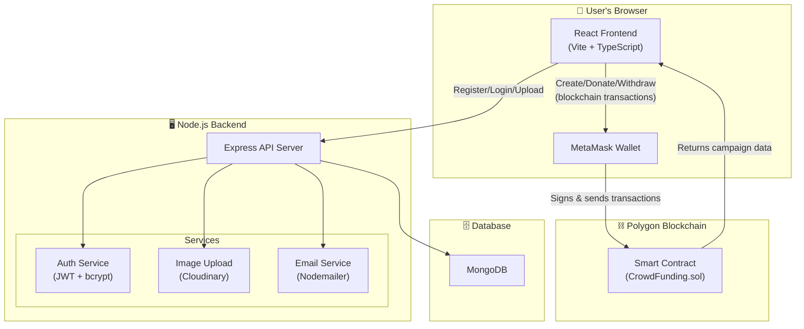
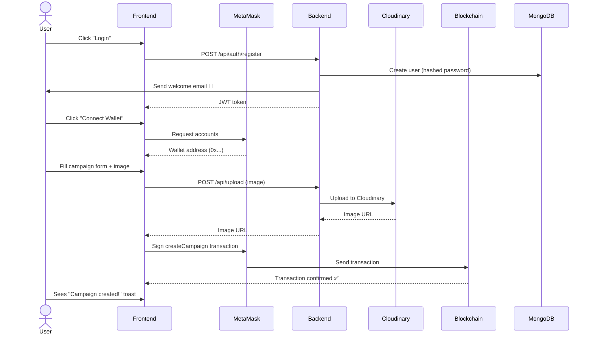
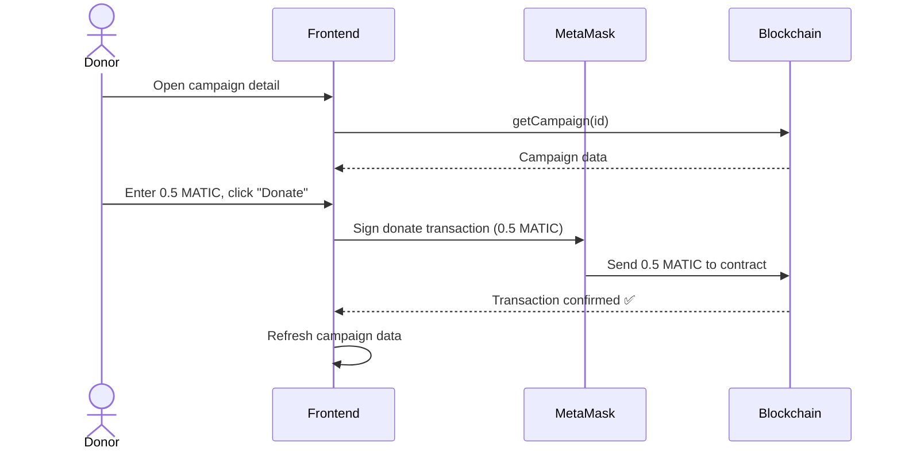
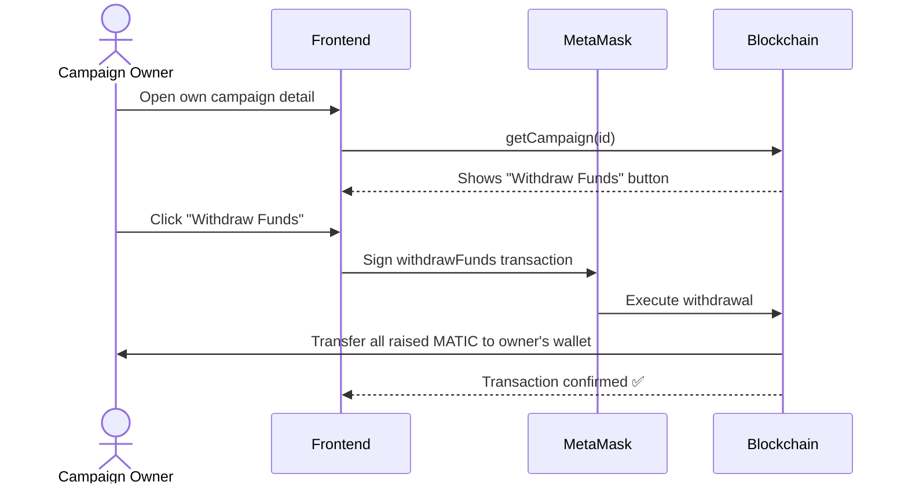

# 🏗️ TheSaviour — Complete Project Breakdown

## What is this project?

**TheSaviour** is a **blockchain-based crowdfunding platform** (like GoFundMe, but on blockchain). It lets people:

1. **Create fundraising campaigns** (e.g., "Help me build a school")
2. **Donate cryptocurrency (MATIC/POL)** to campaigns
3. **Withdraw funds** if you're the campaign owner
4. **Claim refunds** if a campaign fails to reach its goal

The money flows through a **smart contract on the Polygon blockchain**, meaning **no middleman** — everything is transparent and trustless.

---

## 🧩 The Big Picture — How Everything Connects



> [!IMPORTANT]
> This project has **two layers of data storage**:
> - **Blockchain (smart contract)**: Stores campaign data + handles all money (donations, withdrawals, refunds) — this is the **source of truth** for financial data
> - **MongoDB (backend database)**: Stores user accounts, email info, and campaign metadata for notifications — this is **supplementary**

---

## 📁 Project Structure — File by File

### The project has 2 main folders:

```
blockchain-main/
├── thesaviour-backend-main/    ← Node.js API server
└── thesaviour-frontend-main/   ← React web app
```

---

## 🖥️ BACKEND (Node.js + Express + TypeScript)

The backend handles **user accounts, image uploads, and email notifications**. It does NOT handle money — that's the smart contract's job.

### Technology Stack
| Technology | Purpose |
|---|---|
| **Express.js** | Web server framework |
| **MongoDB + Mongoose** | Database for users & campaign metadata |
| **bcryptjs** | Password hashing (security) |
| **jsonwebtoken (JWT)** | Login tokens (authentication) |
| **Cloudinary** | Cloud image hosting |
| **Multer** | File upload handling |
| **Nodemailer** | Sending emails via Gmail |

---

### 📄 [index.ts](file:///c:/Users/jadon/OneDrive/Desktop/blockchain-main/thesaviour-backend-main/src/index.ts) — Entry Point

This is where the server starts. It does 3 things:
1. **Sets up Express** with CORS (allows the frontend at `thesaviour-static.vercel.app` to talk to it)
2. **Registers 3 route groups**: `/api/auth`, `/api/upload`, `/api/campaigns`
3. **Connects to MongoDB** using a connection string from environment variables

---

### 📂 Models (Database Schemas)

#### [User.ts](file:///c:/Users/jadon/OneDrive/Desktop/blockchain-main/thesaviour-backend-main/src/models/User.ts) — User Account

```
User {
  name:      string    ← "Jadon"
  email:     string    ← "jadon@email.com" (must be unique)
  password:  string    ← hashed password (not plain text!)
  createdAt: Date      ← when they registered
}
```

#### [Campaign.ts](file:///c:/Users/jadon/OneDrive/Desktop/blockchain-main/thesaviour-backend-main/src/models/Campaign.ts) — Campaign Metadata

```
Campaign {
  contractId:  number  ← ID from the blockchain smart contract
  title:       string  ← "Help Build a School"
  description: string  ← campaign story
  imageUrl:    string  ← Cloudinary image URL
  goalAmount:  string  ← target amount
  owner:       string  ← wallet address (0x...)
  ownerEmail:  string  ← for sending donation notifications
  ownerName:   string  ← for email greetings
  createdAt:   Date
}
```

> [!NOTE]
> This Campaign model is a **mirror/supplement** of what's on the blockchain. The blockchain smart contract stores the real campaign data. This MongoDB copy exists mainly so the backend can **send email notifications** when someone donates (the blockchain doesn't know email addresses).

---

### 📂 Controllers (Business Logic)

#### [authController.ts](file:///c:/Users/jadon/OneDrive/Desktop/blockchain-main/thesaviour-backend-main/src/controllers/authController.ts) — Registration & Login

**`register`** — Creates a new account:
1. Checks if email already exists
2. Hashes the password with bcrypt (so even if database is hacked, passwords are safe)
3. Creates the user in MongoDB
4. Generates a JWT token (valid for 7 days)
5. Sends a **welcome email** (but registration still succeeds even if email fails)
6. Returns the token + user info

**`login`** — Logs in an existing user:
1. Finds user by email
2. Compares password hash
3. Returns a JWT token + user info

#### [campaignController.ts](file:///c:/Users/jadon/OneDrive/Desktop/blockchain-main/thesaviour-backend-main/src/controllers/campaignController.ts) — Campaign Operations

**`saveCampaign`** — Saves campaign metadata to MongoDB (called after creating a campaign on blockchain)

**`notifyDonation`** — When someone donates, this sends an **email to the campaign owner** saying "Hey, you got a donation of X POL from address Y!"

**`getCampaigns`** — Returns all campaigns from MongoDB (sorted newest first)

---

### 📂 Middleware (Request Interceptors)

#### [auth.ts](file:///c:/Users/jadon/OneDrive/Desktop/blockchain-main/thesaviour-backend-main/src/middleware/auth.ts) — JWT Authentication Guard

This checks if a request has a valid JWT token in the `Authorization` header. If not, it blocks the request with a 401 error. Used to protect routes like "save campaign" — only logged-in users can create campaigns.

**How it works:**
```
Request → Has "Bearer <token>" header? → Verify token → Extract user ID → Continue
                      ↓ No
                 Return 401 "No token"
```

#### [upload.ts](file:///c:/Users/jadon/OneDrive/Desktop/blockchain-main/thesaviour-backend-main/src/middleware/upload.ts) — Cloudinary Image Upload

Configures **Cloudinary** (a cloud image service) and **Multer** (file upload handler). When someone uploads an image, it goes directly to Cloudinary's `crowdfunding-campaigns` folder and returns a URL.

---

### 📂 Utils (Utilities)

#### [emailService.ts](file:///c:/Users/jadon/OneDrive/Desktop/blockchain-main/thesaviour-backend-main/src/utils/emailService.ts) — Email Sender

Uses **Nodemailer** with Gmail SMTP to send two types of emails:
1. **Welcome Email** — "Welcome to TheSaviour! 🎉" — sent when someone registers
2. **Donation Email** — "New Donation on your campaign! 💰" — sent to campaign owner when they receive a donation

---

### 📂 Routes (URL → Controller Mapping)

| Route File | URL | Method | Auth Required? | What it does |
|---|---|---|---|---|
| [auth.ts](file:///c:/Users/jadon/OneDrive/Desktop/blockchain-main/thesaviour-backend-main/src/routes/auth.ts) | `/api/auth/register` | POST | No | Create account |
| | `/api/auth/login` | POST | No | Login |
| [campaigns.ts](file:///c:/Users/jadon/OneDrive/Desktop/blockchain-main/thesaviour-backend-main/src/routes/campaigns.ts) | `/api/campaigns/save` | POST | **Yes** | Save campaign to DB |
| | `/api/campaigns/notify-donation` | POST | No | Send donation email |
| | `/api/campaigns/` | GET | No | Get all campaigns |
| [uploadRoute.ts](file:///c:/Users/jadon/OneDrive/Desktop/blockchain-main/thesaviour-backend-main/src/routes/uploadRoute.ts) | `/api/upload` | POST | No | Upload image to Cloudinary |

---

## ⚛️ FRONTEND (React + Vite + TypeScript)

### Technology Stack
| Technology | Purpose |
|---|---|
| **React 19** | UI framework |
| **Vite** | Build tool & dev server |
| **TypeScript** | Type-safe JavaScript |
| **ethers.js** | Ethereum/Polygon blockchain interaction |
| **MetaMask** | Browser wallet for signing transactions |

---

### 📄 [contract.ts](file:///c:/Users/jadon/OneDrive/Desktop/blockchain-main/thesaviour-frontend-main/src/contract.ts) — Smart Contract Definition

This file contains:
- **Contract address**: `0x679CEf275950438b199BF5a68bDCbff9bee258db` (deployed on Polygon)
- **ABI (Application Binary Interface)**: Defines what functions the smart contract has

#### Smart Contract Functions:

| Function | What it does | Who can call it |
|---|---|---|
| `createCampaign(title, description, imageUrl, goalAmount, durationDays)` | Creates a new campaign on the blockchain | Any wallet |
| `donate(id)` | Sends MATIC to a campaign (payable) | Any wallet |
| `withdrawFunds(id)` | Campaign owner takes out the money | Only the campaign owner |
| `claimRefund(id)` | Get your donation back if campaign failed | Donors (if goal not reached & expired) |
| `getAllCampaigns()` | Returns all campaigns | Anyone (read-only) |
| `getCampaign(id)` | Returns one specific campaign | Anyone (read-only) |
| `campaignCount()` | Returns total number of campaigns | Anyone (read-only) |

#### Campaign Data Structure (on blockchain):
```
Campaign {
  id:           uint256   ← unique ID
  owner:        address   ← wallet that created it
  title:        string
  description:  string
  imageUrl:     string
  goalAmount:   uint256   ← target in Wei (smallest unit of MATIC)
  raisedAmount: uint256   ← how much donated so far
  deadline:     uint256   ← Unix timestamp when campaign ends
  withdrawn:    bool      ← has the owner taken the money?
}
```

---

### 📄 [App.tsx](file:///c:/Users/jadon/OneDrive/Desktop/blockchain-main/thesaviour-frontend-main/src/App.tsx) — Main App Component

This is the **root component**. It manages:

1. **Wallet connection** — Connects to MetaMask and gets the user's Ethereum address
2. **Smart contract instance** — Creates an `ethers.Contract` object to call blockchain functions
3. **User authentication** — JWT token + email stored in localStorage
4. **Page routing** — Simple state-based routing (no react-router):
   - `home` → Campaign list
   - `create` → Create new campaign form
   - `detail` → Campaign details + donate
   - `auth` → Login/Register

5. **Navigation bar** — Shows brand name, page links, login/logout, wallet status

---

### 📂 Pages

#### [Home.tsx](file:///c:/Users/jadon/OneDrive/Desktop/blockchain-main/thesaviour-frontend-main/src/pages/Home.tsx) — Campaign List

- Shows a **hero section** with "Fund the Future on Blockchain"
- If wallet not connected → shows "Connect Wallet" button
- Calls `contract.getAllCampaigns()` to fetch all campaigns from blockchain
- Displays campaigns in a **card grid** showing:
  - Image, title, description
  - Progress bar (raised vs goal)
  - Owner's wallet address (shortened)
  - Status badge (Live/Ended)
  - Days remaining

#### [CreateCampaign.tsx](file:///c:/Users/jadon/OneDrive/Desktop/blockchain-main/thesaviour-frontend-main/src/pages/CreateCampaign.tsx) — Create Campaign Form

1. User fills in: title, description, goal amount (MATIC), duration (days), and optionally an image
2. If image selected → uploads to Cloudinary via backend API
3. Calls `contract.createCampaign(...)` → this creates a **blockchain transaction**
4. MetaMask pops up asking user to confirm the transaction
5. After success → redirects to home page

#### [CampaignDetail.tsx](file:///c:/Users/jadon/OneDrive/Desktop/blockchain-main/thesaviour-frontend-main/src/pages/CampaignDetail.tsx) — Campaign Details + Actions

Shows full campaign info with:
- Hero image
- Title, status (Live/Ended/Withdrawn)
- Owner address (with "You" badge if you're the owner)
- Full description
- Deadline, time left, goal, raised amount
- **Funding progress** with big progress bar and percentage

**Action buttons (context-dependent):**
- **Donate**: If campaign is live + wallet connected → enter amount → sends MATIC via smart contract
- **Withdraw Funds**: If you're the owner → takes out the money
- **Claim Refund**: If campaign ended + goal NOT reached → donors can get money back

#### [Auth.tsx](file:///c:/Users/jadon/OneDrive/Desktop/blockchain-main/thesaviour-frontend-main/src/pages/Auth.tsx) — Login / Register

- Toggle between login and register forms
- Calls backend API (`/api/auth/login` or `/api/auth/register`)
- On success → stores JWT token + email in localStorage
- UI text is in Hinglish (Hindi + English mix)

---

### 📂 Utils

#### [api.ts](file:///c:/Users/jadon/OneDrive/Desktop/blockchain-main/thesaviour-frontend-main/src/utils/api.ts) — Backend API Calls

Three functions that talk to the backend at `https://thesaviour-backend.onrender.com`:
- `uploadImage(file, token)` → POST to `/api/upload`
- `registerUser(name, email, password)` → POST to `/api/auth/register`
- `loginUser(email, password)` → POST to `/api/auth/login`

---

## 🔄 Complete User Flows

### Flow 1: New User Creates a Campaign



### Flow 2: Someone Donates



### Flow 3: Owner Withdraws Funds



---

## 🌐 Deployment

| Component | Hosted On | URL |
|---|---|---|
| Frontend | **Vercel** | `https://thesaviour-static.vercel.app` |
| Backend | **Render** | `https://thesaviour-backend.onrender.com` |
| Database | **MongoDB Atlas** | (cloud, via `MONGO_URI` env var) |
| Images | **Cloudinary** | (cloud storage) |
| Smart Contract | **Polygon Blockchain** | Address: `0x679CEf...` |

---

## 🔑 Environment Variables Needed (Backend)

| Variable | Purpose |
|---|---|
| `MONGO_URI` | MongoDB connection string |
| `JWT_SECRET` | Secret key for signing JWT tokens |
| `CLOUDINARY_CLOUD_NAME` | Cloudinary account name |
| `CLOUDINARY_API_KEY` | Cloudinary API key |
| `CLOUDINARY_API_SECRET` | Cloudinary API secret |
| `EMAIL_USER` | Gmail address for sending emails |
| `EMAIL_PASS` | Gmail app password |
| `PORT` | Server port (defaults to 5000) |

---

## 🗝️ Key Concepts Explained

### What is a Smart Contract?
A program that runs on the blockchain. Once deployed, **nobody can change it** — not even the developer. It automatically enforces rules (like "only the owner can withdraw" or "refunds only if goal not reached").

### What is MetaMask?
A browser extension that acts as your **crypto wallet**. It holds your private keys and signs transactions. When the app says "Connect Wallet," it's asking MetaMask to share your wallet address.

### What is MATIC/POL?
The cryptocurrency used on the **Polygon network** (a faster, cheaper alternative to Ethereum). All donations and campaigns use MATIC as currency.

### What is ethers.js?
A JavaScript library that lets the frontend **talk to the blockchain**. It can read data from smart contracts and send transactions through MetaMask.

### What is JWT?
**JSON Web Token** — a secure string that proves "this user is logged in." The backend creates it on login, the frontend stores it, and sends it with every request that requires authentication.

---

## 📊 Summary

| Aspect | Details |
|---|---|
| **Project Type** | Blockchain crowdfunding platform |
| **Frontend** | React + TypeScript + Vite |
| **Backend** | Node.js + Express + TypeScript |
| **Database** | MongoDB (for users & metadata) |
| **Blockchain** | Polygon (for campaigns & money) |
| **Auth** | JWT tokens + bcrypt passwords |
| **Images** | Cloudinary (cloud hosting) |
| **Emails** | Gmail via Nodemailer |
| **Wallet** | MetaMask integration |
| **Total Files** | ~20 source files |
| **Complexity** | Medium (full-stack + blockchain) |
